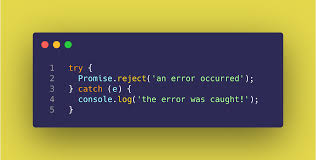
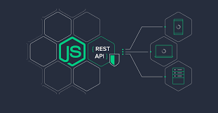
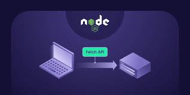
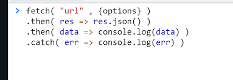

# Что такое синхронный код в JavaScript ?

Синхронный JavaScript. JavaScript является синхронным, блокирующим и однопоточным. Это означает, что движок JavaScript выполняет нашу программу последовательно, по одной строке за раз сверху вниз в точном порядке операторов .

* JavaScript по умолчанию синхронен: каждая строка кода выполняется одна за другой, и каждая задача должна ждать завершения предыдущей, прежде чем перейти к следующей . В приведенном выше примере первая строка кода, One, будет записана первой, за ней следует вторая строка, Two, и третья строка, Three

# Что такое aсинхронный код в JavaScript ?

Подводя итог, асинхронное программирование является важнейшей концепцией в JavaScript, которая позволяет вашему коду работать в фоновом режиме, не блокируя выполнение другого кода . Разработчики могут создавать более эффективные и отзывчивые приложения, используя такие функции, как обратные вызовы, async/await и обещания.

* С помощью асинхронного программирования программы JavaScript могут запускать длительные задачи и продолжать выполнять другие задачи параллельно . Но асинхронные программы сложно писать и сложно отлаживать. Из-за этого большинство современных асинхронных методов JavaScript не используют обратные вызовы.

# Что такое обещания (promises) в JavaScript?

Promise в нашем контексте — это то, что требует некоторого времени для выполнения. Есть два возможных результата обещания:

 * Мы либо запускаем и разрешаем (resolve) promise, либо
* В строке происходит какая-то ошибка, и обещание отклоняется (reject)
Появились promises, чтобы решить проблемы функций обратного вызова.

Promise принимает две функции в качестве параметров:
* resolve() — это успех.
* reject() — при возникновении ошибки.

# Конструкция try / catch

### Как бы мы хорошо ни программировали, в коде бывают ошибки. Или, как их иначе называют, «исключительные ситуации» (исключения).

Обычно скрипт при ошибке, как говорят, «падает», с выводом ошибки в консоль.

Но бывают случаи, когда нам хотелось бы как-то контролировать ситуацию, чтобы скрипт не просто «упал», а сделал что-то разумное.

Для этого в JavaScript есть замечательная конструкция try..catch.

Конструкция try..catch состоит из двух основных блоков: try, и затем catch:

Работает она так:

* Выполняется код внутри блока try.

* Если в нём ошибок нет, то блок catch(err) игнорируется, то есть выполнение доходит до конца try и потом прыгает через catch.

* Если в нём возникнет ошибка, то выполнение try на ней прерывается, и управление прыгает в начало блока catch(err).

* При этом переменная err (можно выбрать и другое название) будет содержать объект ошибки с подробной информацией о произошедшем.

### Таким образом, при ошибке в try скрипт не «падает», и мы получаем возможность обработать ошибку внутри catch.

# API/Rest API

REST API — это способ взаимодействия сайтов и веб-приложений с сервером. Его также называют RESTful.

Термин состоит из двух аббревиатур, которые расшифровываются следующим образом:

# API (Application Programming Interface) 
это код, который позволяет двум приложениям обмениваться данными с сервера. На русском языке его принято называть программным интерфейсом приложения.

# REST (Representational State Transfer)

это способ создания API с помощью протокола HTTP. На русском его называют «передачей состояния представления».

Технологию REST API применяют везде, где пользователю сайта или веб-приложения нужно предоставить данные с сервера. Например, при нажатии иконки с видео на видеохостинге REST API проводит операции и запускает ролик с сервера в браузере. В настоящее время это самый распространенный способ организации API. Он вытеснил ранее популярные способы SOAP и WSDL.

# Fetch

JavaScript может отправлять сетевые запросы на сервер и подгружать новую информацию по мере необходимости.

Например, мы можем использовать сетевой запрос, чтобы:

* Отправить заказ,
* Загрузить информацию о пользователе,
* Запросить последние обновления с сервера.

Метод fetch() — современный и очень мощный, поэтому начнём с него. Он не поддерживается старыми (можно использовать полифил), но поддерживается всеми современными браузерами.

Базовый синтаксис:
* url – URL для отправки запроса.
* options – дополнительные параметры: метод, заголовки и так далее.

Промис завершается с ошибкой, если fetch не смог выполнить HTTP-запрос, например при ошибке сети или если нет такого сайта. HTTP-статусы 404 и 500 не являются ошибкой.

