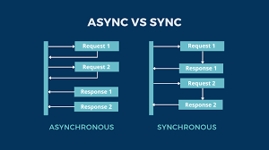
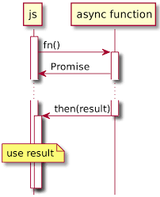
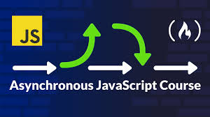
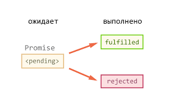
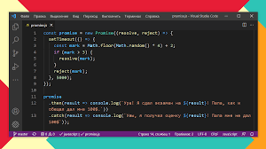

# Что такое синхронный код в JavaScript ?

Синхронный JavaScript. JavaScript является синхронным, блокирующим и однопоточным. Это означает, что движок JavaScript выполняет нашу программу последовательно, по одной строке за раз сверху вниз в точном порядке операторов .

* JavaScript по умолчанию синхронен: каждая строка кода выполняется одна за другой, и каждая задача должна ждать завершения предыдущей, прежде чем перейти к следующей . В приведенном выше примере первая строка кода, One, будет записана первой, за ней следует вторая строка, Two, и третья строка, Three

# Что такое aсинхронный код в JavaScript ?

Подводя итог, асинхронное программирование является важнейшей концепцией в JavaScript, которая позволяет вашему коду работать в фоновом режиме, не блокируя выполнение другого кода . Разработчики могут создавать более эффективные и отзывчивые приложения, используя такие функции, как обратные вызовы, async/await и обещания.

* С помощью асинхронного программирования программы JavaScript могут запускать длительные задачи и продолжать выполнять другие задачи параллельно . Но асинхронные программы сложно писать и сложно отлаживать. Из-за этого большинство современных асинхронных методов JavaScript не используют обратные вызовы.

# Что такое обещания (promises) в JavaScript?

Promise в нашем контексте — это то, что требует некоторого времени для выполнения. Есть два возможных результата обещания:

 * Мы либо запускаем и разрешаем (resolve) promise, либо
* В строке происходит какая-то ошибка, и обещание отклоняется (reject)
Появились promises, чтобы решить проблемы функций обратного вызова.

Promise принимает две функции в качестве параметров:
* resolve() — это успех.
* reject() — при возникновении ошибки.

